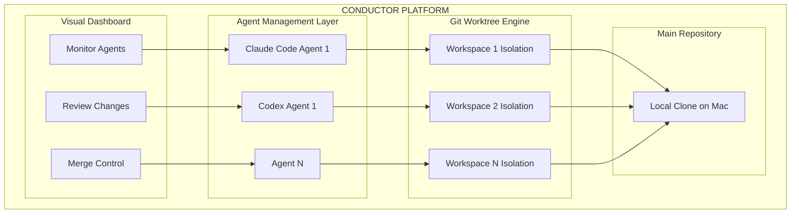
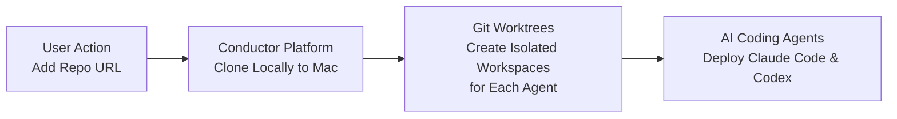
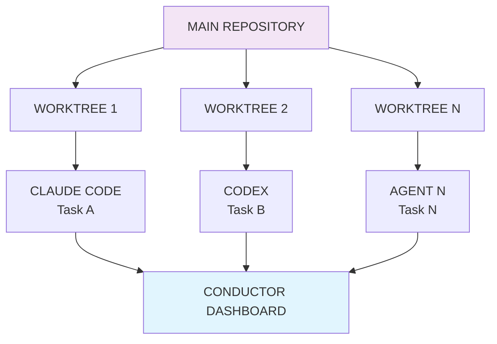
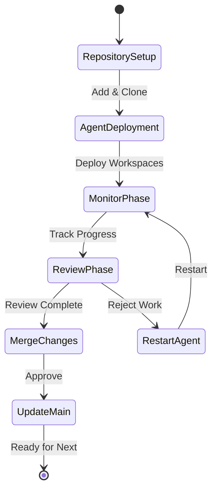
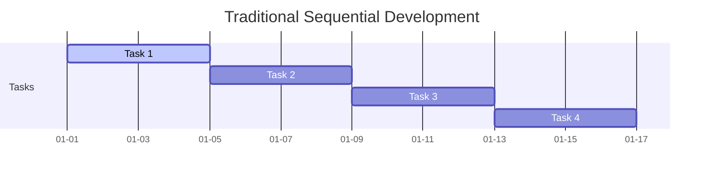
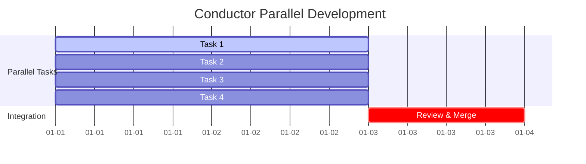
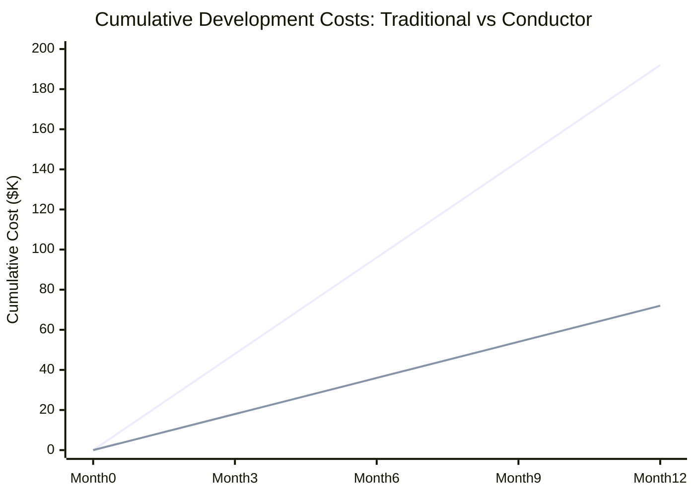

## TL;DR

[Conductor](https://conductor.build) is an orchestration platform that lets you run multiple Claude Code and Codex agents simultaneously on the same codebase. It creates isolated workspaces using git worktrees, provides a dashboard to monitor all agents, and handles the complexity of parallel AI development. Essentially, it transforms sequential AI-assisted coding into parallel team-based workflows, multiplying productivity while maintaining code integrity.

**Key Value:** 3-4x productivity boost for teams using AI coding assistants through parallelization and intelligent management.

---

## Executive Summary

Conductor is a specialized orchestration platform for team-based AI-assisted development, enabling multiple Claude Code and Codex agents to work simultaneously in isolated environments. It transforms single-repository development into a parallel, multi-agent workflow while maintaining code integrity through sophisticated git worktree management.

## Core Concept

**Problem Solved:** Managing multiple AI agents working on the same codebase without conflicts, while providing visibility and control over parallel development activities.

**Solution:** A platform that creates isolated git worktrees for each agent, provides a unified management interface, and handles the complexity of parallel AI-assisted development.

## Technical Architecture

### Foundation Layer
- **Git Worktrees:** Each agent works in an isolated workspace using git's worktree feature
- **Local Processing:** All operations occur on the user's Mac (no cloud dependencies)
- **Repository Management:** Automatic cloning and setup of codebases

### Orchestration Layer
- **Multi-Agent Deployment:** Simultaneous execution of multiple Claude Code and Codex agents
- **Workspace Isolation:** Complete independence between agent workspaces
- **Resource Management:** Efficient allocation of development resources

### Management Layer
- **Visual Dashboard:** Real-time monitoring of all agent activities
- **Progress Tracking:** At-a-glance status of parallel tasks
- **Code Review Interface:** Centralized location for reviewing and merging changes

## System Architecture

## Workflow Process

### 1. Repository Setup Flow

### 2. Parallel Development Architecture

### 3. Complete Development Lifecycle

## Productivity Comparison

### Traditional Sequential Development

### Conductor Parallel Development

## Key Benefits

### 1. **Productivity Multiplication**
- **Parallel Processing:** Multiple agents work simultaneously instead of sequentially
- **Time Savings:** Reduces development time from sequential to concurrent execution
- **Resource Optimization:** Maximizes the value of AI agent subscriptions

### 2. **Code Integrity & Safety**
- **Complete Isolation:** Each agent works independently without risk of interference
- **Git Safety:** Proper branch management prevents code corruption
- **Rollback Capability:** Easy to discard unwanted changes from specific agents

### 3. **Workflow Management**
- **Visual Clarity:** Clear overview of all parallel activities
- **Progress Monitoring:** Real-time status updates across all agents
- **Quality Control:** Centralized review process for all agent-generated code

### 4. **Team Collaboration**
- **Shared Visibility:** Team members can see all AI work in progress
- **Coordinated Development:** Better planning of parallel tasks
- **Knowledge Sharing:** Learn from successful agent patterns

### 5. **Reduced Cognitive Load**
- **Automated Management:** No manual git worktree operations required
- **Simplified Complexity:** Platform handles the technical details
- **Focus on Outcomes:** Users can concentrate on high-level direction rather than infrastructure

### 6. **Multi-Platform Flexibility**
- **Universal Support:** Works with both Claude Code and Codex agents
- **Future-Proof:** Positioned to add more AI coding platforms
- **Vendor Diversity:** Reduces dependency on single AI provider

## Competitive Advantages

### 1. **Multi-Platform Specialization**
- **Dual Support:** Built for both Claude Code and Codex agents
- **Optimized Workflows:** Tailored for each AI platform's strengths
- **Deep Integration:** Full git-based development support

### 2. **Simplicity in Complexity**
- **Abstracts Complexity:** Manages git worktree operations automatically
- **Intuitive Interface:** Sophisticated operations made simple
- **Low Learning Curve:** Powerful capabilities with minimal training

### 3. **Local-First Approach**
- **Privacy First:** All processing occurs locally
- **No Latency:** No cloud dependencies for core operations
- **Enhanced Security:** Code never leaves your machine

### 4. **Vendor Agnostic Strategy**
- **Platform Flexibility:** Support for multiple AI providers
- **Future Ready:** Positioned to add new AI coding assistants
- **Risk Mitigation:** Reduces lock-in to single AI vendor

## ROI Analysis

> **Note:** The following analysis is based on theoretical presumptions and projected productivity gains. Actual results may vary based on team size, project complexity, and implementation effectiveness.

### Cost Comparison

| Approach | Weekly Cost | Monthly Cost | Annual Cost |
|----------|-------------|--------------|-------------|
| Traditional Development | $4,005 | $16,020 | $192,240 |
| With Conductor | $1,505 | $6,020 | $72,240 |
| **Savings** | **$2,500** | **$10,000** | **$120,000** |

### Cumulative Cost Over Time

### Breakdown

**Traditional Development:**
- 1 Developer × 40 hours/week × $100/hour = $4,000/week
- Claude Code Pro: $20/month = $5/week ([source](https://claude.com/pricing))
- **Total = $4,005/week**

**With Conductor:**
- 1 Developer × 15 hours/week × $100/hour = $1,500/week
- Claude Code Pro: $20/month = $5/week
- Conductor Platform = $0/week (assuming open-source)
- **Total = $1,505/week**

**Presumptions:**
- **Developer rate:** $100/hour (senior developer rate)
- **Time reduction:** From 40 hours to 15 hours/week (62.5% reduction)
- **Claude Code pricing:** $20/month Pro plan
- **Conductor cost:** Free (based on current website)
- **Productivity gain:** 3-4x based on parallel processing capabilities

**ROI Timeline:**
- **Weekly Savings:** $2,500 (62.4% reduction)
- **Break-even:** Immediate (no additional licensing costs beyond existing Claude Code)
- **Annual Net Savings:** $120,000

### Additional Value from Multi-Platform Support

**Risk Mitigation:**
- Reduced vendor lock-in risk
- Ability to leverage best tool for each task
- Future-proofing against platform changes

**Capability Expansion:**
- Access to different AI strengths (Claude's reasoning + Codex's code generation)
- Broader team skill utilization
- Competitive advantage through AI diversity

The investment in Conductor provides immediate returns and scales significantly with team size, project complexity, and multi-platform AI strategy.

---

## References

1. **[Conductor](https://conductor.build)** - Orchestration platform for multi-agent AI development
2. **[Claude Code Pricing](https://claude.com/pricing)** - Subscription costs for AI coding assistant
3. **[Git Worktrees](https://git-scm.com/docs/git-worktree)** - Git feature for managing multiple working trees
4. **[Mermaid.js](https://mermaid.js.org/)** - Diagramming and charting library for technical documentation

*This analysis represents independent research and is not affiliated with Conductor, Claude, or Anthropic. All cost projections are estimates based on publicly available information.*

---

🤖 Generated in collaboration with [Claude Code](https://claude.ai/claude-code) - GLM 4.6