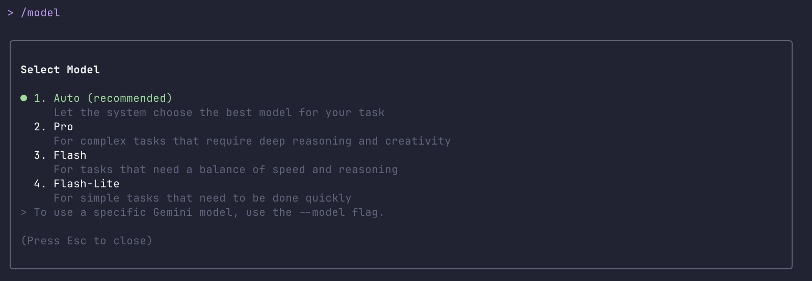
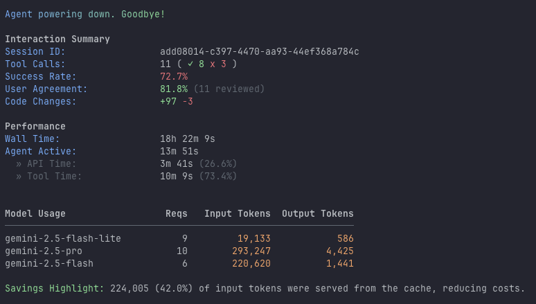
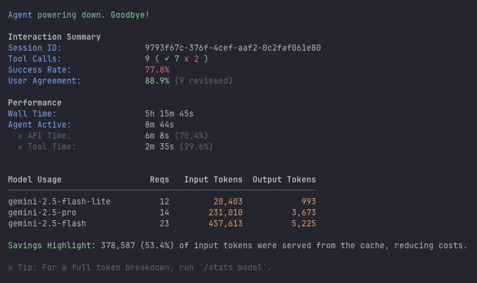

## Forget the Dials: How Gemini CLI's Auto-Mode is Making AI Effortless

If you’ve ever used a powerful AI tool, you’ve likely faced the "pilot’s cockpit" problem. You have an array of models at your fingertips—Flash for speed, Pro for power, maybe a specialized model for coding. Each has its own strengths, weaknesses, and costs. Choosing the right one for every single prompt feels less like a conversation and more like a constant series of micro-decisions.

Do I need the powerhouse for this simple question? Am I wasting its potential? Am I slowing myself down?

This friction, this constant need to tweak the settings, is one of the biggest hurdles to making AI a truly seamless part of our workflow. The Gemini CLI team saw this as a fundamental challenge. For AI to move beyond a tool for specialists and become a genuine partner for everyone, it needed to get out of its own way.

The answer is a feature that sounds deceptively simple: **Auto-mode**.



### The 'Aha!' Moment: From Manual Control to Intelligent Partner

The inspiration behind this shift wasn't just about convenience; it was a philosophical evolution. The team recognized that the user's goal isn't to *manage an AI model*; it's to *get a task done*. Every moment spent deliberating over which model to use is a moment not spent on the actual work.

This challenge isn't unique. Across the landscape of agentic tools, we see different approaches to this "pilot's cockpit" problem. In the **Anthropic ecosystem**, attempts at intelligent model selection reveal just how difficult this problem truly is.

Consider Claude Code's "opusplan" feature and broader model selection challenges, which reveal how difficult intelligent routing truly is. While opusplan theoretically "uses opus during plan mode, then switches to sonnet for execution,"<sup>[1](https://code.claude.com/docs/en/model-config)</sup> the implementation has been plagued by issues.

> The implementation of Opus plan mode keeps claude-opus-4-1-20250805 in the system prompt at all times, which we can consider a bug.<sup>[2](https://github.com/anthropics/claude-code/issues/6108)</sup>

But the problems run deeper: a fresh issue from just last week reveals that Claude Code incorrectly uses Opus for the first 25% of usage even when Sonnet 4.5 is explicitly selected.<sup>[3](https://github.com/anthropics/claude-code/issues/11452)</sup>

This pattern of model selection failures extends across the platform: users report "OPUS TOKENS RUNNING WITHOUT OPUS BEING SELECTED"<sup>[4](https://github.com/anthropics/claude-code/issues/8688)</sup> and even Haiku users finding unexpected Opus charges draining their quotas.<sup>[5](https://github.com/anthropics/claude-code/issues/10829)</sup>

These ongoing challenges in the Claude ecosystem highlight why Gemini CLI's Auto-mode approach is such a welcomed development. While real-world, long-term testing will ultimately determine its reliability, Auto-mode's transparent routing and detailed interaction summaries suggest a promising solution to one of AI tooling's most persistent friction points. The contrast between these approaches reveals how much careful engineering goes into making "intelligent" model selection truly work in practice.

Other approaches in the Anthropic ecosystem involve manual model selection (`claude --model sonnet`) or clever aliases that hint at smarter routing. While these are all steps toward a more fluid experience, they often still place the burden of choice or initial configuration on the user. The core insight of a truly "auto" mode is to make this intelligence ambient and invisible. What if the tool was smart enough to make the decision for you, every single time?

### Under the Hood: The AI Traffic Controller

Think of Auto-mode as an intelligent dispatcher sitting between you and the powerful Gemini models. Here’s how it works:

1.  **It Analyzes the Intent:** When you type a prompt, Auto-mode doesn't just pass it along. It first performs a rapid analysis of your request. Is it a simple command, like converting a date format? Is it a moderately complex task, like summarizing a file? Or is it a deeply complex request, like architecting a new software component?

2.  **It Routes to the Right Specialist:** Based on that analysis, it routes your request to the optimal model for the job:
    *   **Simple Task? -> Flash Lite:** For quick, straightforward queries, it uses the fastest, most efficient model to give you an almost instantaneous answer.
    *   **Balanced Need? -> Flash:** For tasks requiring a mix of speed and solid reasoning, it calls on the balanced Flash model.
    *   **Complex Problem? -> Pro:** When you ask for deep, creative, or highly complex analysis, it automatically engages the most powerful Pro model to ensure the highest quality response.

This all happens in a fraction of a second. You don't see the routing; you just experience the result: a fast response for simple things, and a powerful, well-reasoned response for hard things.

### From the Lab to the Wild

<blockquote class="twitter-tweet">
  <p lang="en" dir="ltr">New patch version of Gemini CLI v0.11.2 is out 🚀<br><br>Model routing is now enabled by default... what the heck is model routing?<br><br>It means based on complexity of the request different models will now be used:<br>• &quot;hi 👋&quot; ➜ 2.5 Flash<br>• &quot;refactor my codebase&quot; ➜ 2.5 Pro<br><br>What does this mean for you, the user?<br><br>• 📉 Reduced latency for a snappier experience<br>• 💰 Extended quotas by using the Pro model only for tasks that truly require it.<br><br>This should help alleviate some of the capacity issues on the Pro model, while letting your Pro quotas go much further and extending your sessions.<br><br>Easily disable model routing with /model to only use one model.<br><br>Read more about model routing: <a href="https://t.co/elBbqdvilO">https://t.co/elBbqdvilO</a></p>
  &mdash; Jack Wotherspoon (@JackWoth98) <a href="https://twitter.com/JackWoth98/status/1984290306729087483">October 31, 2025</a>
</blockquote>
<script async src="https://platform.twitter.com/widgets.js" charset="utf-8"></script>

Released to the public on **[October 31, 2025](https://github.com/google-gemini/gemini-cli/discussions/12375)**, Auto-mode (initially part of a broader "Agent Mode" update) was a significant step forward. In the months since, the real-world feedback has mirrored the internal goals: users feel the CLI is more responsive and intuitive. They can stay in their creative flow without getting bogged down in technical choices.

While internal testing focused on optimizing the routing logic for speed and quality, the true test was whether users would trust it. The answer has been a resounding yes. It just works.

### Behind the Scenes: A Glimpse at the Logs

For those curious about the inner workings, the CLI often logs its model choices. For instance, a session might show entries like:

```json
{
  "timestamp": "2025-11-16T09:10:54.877Z",
  "type": "user",
  "content": "Try writing the file again please",
  "model": "gemini-2.5-pro"
},
{
  "timestamp": "2025-11-16T12:10:27.221Z",
  "type": "user",
  "content": "LGTM",
  "model": "gemini-2.5-flash"
}
```

These logs provide a tangible link between your prompts and the intelligent routing decisions made by Auto-mode. At the end of a session, the CLI provides a full "Interaction Summary," which gives a high-level breakdown of which models were used and how often. These summaries reveal the full picture, including the work done by the ultra-efficient `gemini-2.5-flash-lite` model for trivial tasks, which often doesn't appear in the main turn-by-turn log.

Here are the summaries from the two sessions we analyzed:


*<center>Interaction Summary for our first session (ID add08014...)</center>*


*<center>Interaction Summary for our second, more analytical session (ID 9793f67c...)</center>*

These summaries confirm our "Architect, Technician, and Silent Workhorse" theory, showing how the CLI dynamically allocates resources based on the user's needs.

### The Agent's Inner Monologue: A Glimpse into Auto-Mode's Decisions

For developers and power users, understanding the 'why' behind a tool's behavior is key to mastering it. Seeing the agent's thought process helps build a **mental model** of how Auto-mode works, allowing you to craft more effective prompts and predict the tool's response. This isn't just about curiosity; it's about becoming a more effective collaborator with your AI partner. Below, we've extracted the agent's 'inner monologue' during two key moments from our sessions:

#### Case Study 1: Devising a Content Strategy (Gemini 2.5 Pro)

When asked a complex, strategic question about how to position the blog post, the Pro model didn't just give a simple answer. It went through a multi-step process of analysis and strategy formulation, as revealed by its internal thoughts:

*   **`Focusing the Post's Scope`**: "I'm currently dissecting the user's primary concerns... The central dilemma seems to revolve around whether the focus should be tightly knit to 'Gemini CLI' or if it should be broadened to capture a wider audience. I'm leaning toward weighing the pros and cons..."
*   **`Considering Broader Appeal`**: "I'm now contemplating whether broadening the blog post's scope... would be beneficial. I'm carefully weighing the pros and cons, which include factors like audience size, search engine optimization, and the blog's potential longevity..."
*   **`Formulating the Blog Strategy`**: "I've been analyzing the user's files to understand their blog's goals. I'm leaning toward a hybrid strategy: starting with the broader concept of AI/agentic CLI tools, then diving into Gemini CLI as a specific case study. The goal is to maximize appeal while demonstrating expertise."

This sequence of thoughts demonstrates the Pro model's capacity for abstract reasoning, strategic planning, and synthesizing information from multiple sources to form a coherent recommendation.

#### Case Study 2: Composing a Narrative from Scratch (Gemini 2.5 Pro)

When asked to help compose the blog post itself, the Pro model immediately started thinking like a writer, focusing on narrative structure and audience engagement:

*   **`Unpacking the Request`**: "I'm currently dissecting the user's prompt to pinpoint the core focus... My aim is to craft a compelling narrative for a blog post. I'm focusing on user need, and I will be working on a blog post structure."
*   **`Refining the Narrative`**: "I'm now zeroing in on the narrative structure. The 'hook' is solid - the paradox of choice is relatable. I'm focusing on framing the problem, exploring the feeling of being overwhelmed by too many options."
*   **`Exploring the Analogy`**: "I'm developing a strong analogy for Auto-mode, focusing on making it intuitive... I'm prioritizing clarity... focusing on the 'intelligent routing' aspect. I think it is important to not get lost in jargon or technical details."
*   **`Developing the Framework`**: "I'm now solidifying the blog post's foundation... The analogy of the smart mail sorter is becoming the 'AI Traffic Controller.' I'm now crafting the 'Under the Hood' section of the blog post... My first step involves crafting the hook, leveraging the 'paradox of choice' to immediately resonate with the reader."

Here, the Pro model's thoughts reveal its ability to break down a creative task into structured components, consider rhetorical devices (like analogies), and plan a narrative flow—all critical elements of effective content creation.

### The New Standard for AI Interaction

Compared to the manual selection required by many other tools, Gemini's Auto-mode feels like a glimpse into the future of human-AI interaction. It’s a move away from explicit commands and toward an "ambient" experience, where the technology adapts to the user, not the other way around.

This isn't just a feature for developers. It’s what makes the Gemini CLI a no-brainer for writers, researchers, marketers, and anyone who wants to leverage the power of AI without needing a degree in model architecture. It democratizes access by removing a layer of complexity that most users simply don't need.

### Challenge the CLI: Predict the Model

Want to test your understanding of Auto-mode? Try these prompts in the Gemini CLI and see if you can predict which model (Flash Lite, Flash, or Pro) the CLI will choose, and why.

*   **Prompt 1 (Simple):** `What is the capital of France?`
*   **Prompt 2 (Moderate):** `Summarize the key arguments from the 'AGENTS.md' file in three bullet points.`
*   **Prompt 3 (Complex):** `Draft a short, persuasive email to a potential investor, explaining the core value proposition of a new AI-powered research assistant. Focus on market opportunity and competitive advantage.`

The story of Auto-mode is the story of getting technology out of the way so that human creativity can shine. It’s about focusing on the "what," not the "how," and trusting you have an intelligent partner on the other side, ready to handle the details for you.

### The Evolving Intelligence

Auto-mode is not a static feature; its underlying routing logic is constantly learning and being refined. As AI models themselves evolve, and as new use cases emerge, the intelligence behind Auto-mode will adapt, becoming even more adept at anticipating your needs and delivering optimal results.

However, only extended real-world use will reveal whether this intelligent routing holds up under diverse conditions. Questions remain about how well Auto-mode handles edge cases, maintains performance at scale, and adapts to changing user needs over time. The early promise is compelling, but the true test will be how this system performs across thousands of users and countless different use cases.

---

🤖 Co-Authored-By: [Gemini CLI](https://geminicli.com/)