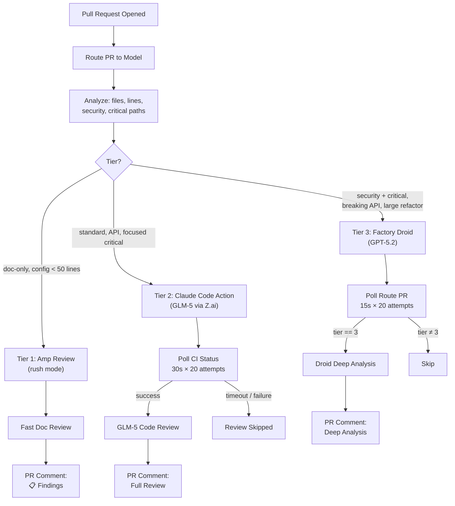
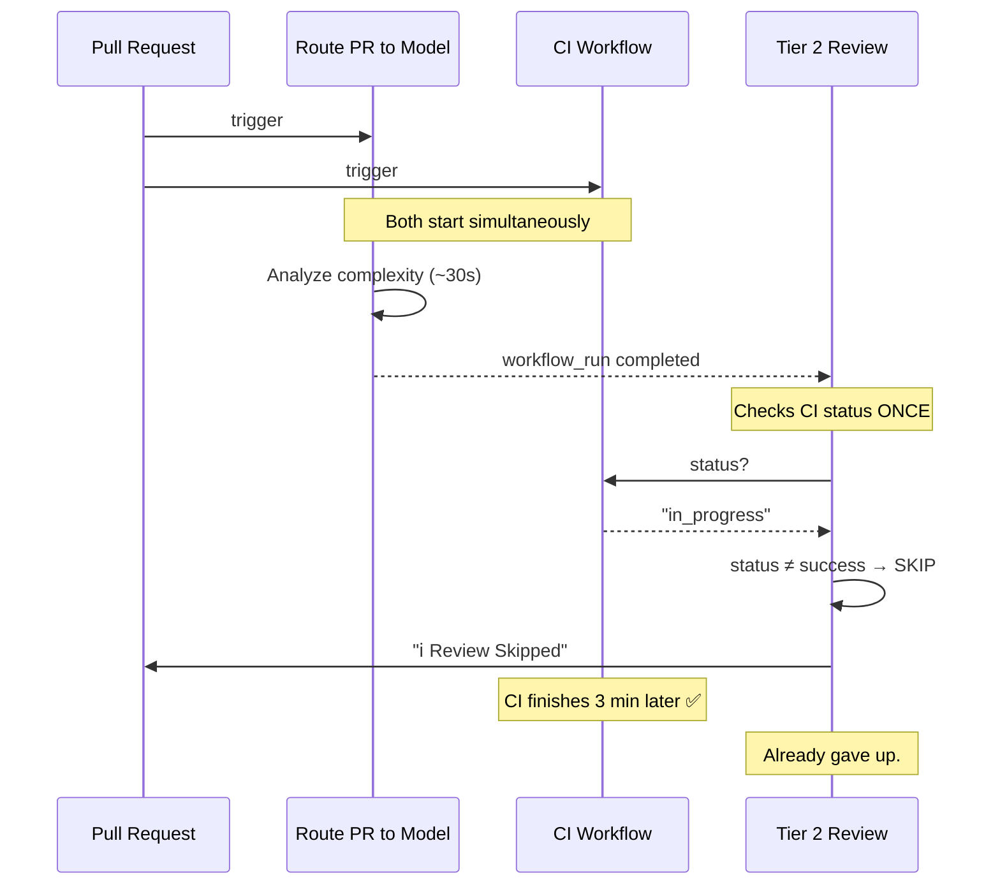
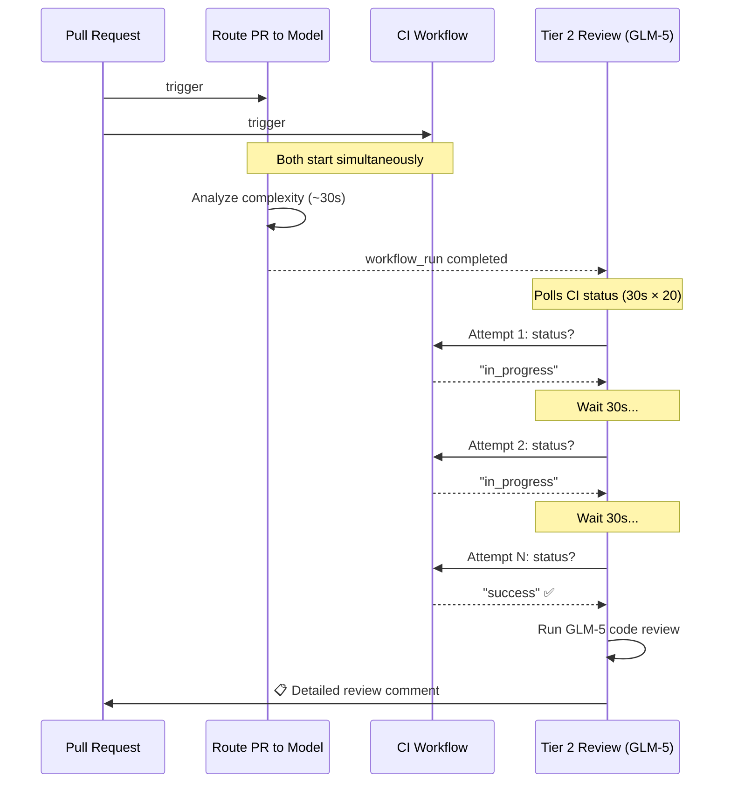

## TL;DR

We implemented a three-tier AI code review pipeline in GitHub Actions that routes PRs to different models based on complexity: Amp (rush mode) for docs, GLM-5 for standard changes, and GPT-5.2 for security-critical work. The result: **~87% cost reduction** compared to using premium models for everything. But the journey revealed two silent failures—a CI race condition and a `paths-ignore` contradiction—that taught us orchestration is as important as model choice.

**Key Takeaway:** The best model doesn't help if the workflow that invokes it never runs. Design your AI pipeline observability for the gaps *between* workflows, not just within them.

---

**In our [previous article]({{ site.baseurl }}/foundation-model-selection-ai-testing/)** on foundation model selection, we proposed a tiered framework: fast triage on cheap models, standard testing on mid-range models, deep analysis on premium models. We even included pseudocode.

But pseudocode is comfortable. Production is where ideas get tested.

So we built it. The [Claude Marketplace Registry](https://github.com/shrwnsan/claude-marketplace-registry) — an open-source aggregator for Claude Code plugins — became our testing ground. Every pull request now flows through a tiered AI review pipeline that routes to different models based on complexity. Three tiers. Three AI agents. Three different cost profiles.

It worked. Then it silently broke. Then we fixed it. Here's the full story.

## The theory, briefly

Our [previous article]({{ site.baseurl }}/foundation-model-selection-ai-testing/) proposed a simple idea: don't use one model for everything. Instead, match the model to the task:

| Tier | Purpose | Model | Cost Profile |
|------|---------|-------|-------------|
| **Tier 1** | Fast triage | Claude Haiku 4.5 / GLM Flash | Ultra-cheap |
| **Tier 2** | Standard testing | GPT-5.2 / GLM-5 | Balanced |
| **Tier 3** | Deep analysis | Claude Opus 4.5 / GPT-5.2 | Premium |

The pseudocode looked clean:

```python
if pr_context.is_documentation_only:
    return "claude-haiku-4-5"     # Tier 1
if pr_context.has_security_implications:
    return "gpt-5-2"              # Tier 2
if pr_context.affects_core_architecture:
    return "claude-opus-4-5"      # Tier 3
```

Translating that into GitHub Actions workflows — where timing, event triggers, and cross-workflow communication actually matter — told a different story.

---

## The architecture we built

The implementation uses four GitHub Actions workflows that coordinate through artifacts and `workflow_run` events:



Four workflow files make this work:

1. **`route-pr-to-model.yml`** — The router. Analyzes every PR for file types, line count, security signals, and critical paths. Outputs a tier (1, 2, or 3) and a reason.

2. **`amp-review-tier1.yml`** — Tier 1 executor. Uses [Amp Code Action](https://ampcode.com) in `rush` mode for documentation-only and minimal config changes. Fast, focused, cheap.

3. **`claude-auto-pr-review.yml`** — Tier 2 executor. Uses Claude Code Action pointed at [Z.ai's API proxy](https://z.ai/model-api) serving GLM-5. Waits for CI to pass, then runs a full code review.

4. **`droid-review.yml`** — Tier 3 executor. Uses [Factory Droid](https://docs.factory.ai/) with GPT-5.2 for security-critical and architecturally significant changes.

### The routing logic

The router doesn't use a simple if-else chain. It scores complexity from 1–10 by examining the actual PR diff:

```javascript
// Tier 1: Fast triage
if (docOnly) {
  tier = 1; reason = 'Documentation only'; complexity = 1;
} else if (configOnly && changedLines < 50) {
  tier = 1; reason = 'Config changes only, minimal'; complexity = 2;
}

// Tier 3: Deep analysis
if (hasSecurity && hasCriticalPaths) {
  tier = 3; reason = 'Security-critical paths touched'; complexity = 9;
} else if (hasBreakingChange && hasAPI) {
  tier = 3; reason = 'Breaking API changes'; complexity = 8;
} else if (hasCriticalPaths && changedLines > 500) {
  tier = 3; reason = 'Large critical path refactor'; complexity = 8;
}

// Everything else: Tier 2 (default)
```

What makes this work in practice is the `hasCriticalPaths` check — it matches against specific directory patterns (`src/services`, `pages/api`, `.github/workflows`) rather than relying on abstract "risk scores." The PR itself tells you what it touches.

---

## What we actually deployed

Here's where theory diverges from practice. The previous article's framework mapped models neatly to tiers. The reality required adaptation:

| Article Theory | What We Actually Used | Why |
|---|---|---|
| **Tier 1:** Claude Haiku 4.5 | **Amp Code** (rush mode) | Amp's rush mode is optimized for fast PR triage; Haiku isn't available as a standalone GitHub Action |
| **Tier 2:** GPT-5.2 | **GLM-5** via Z.ai proxy | GLM-5 scores 77.8 on SWE-Bench Verified at a fraction of GPT-5.2's cost. Z.ai's Anthropic-compatible proxy lets us use `claude-code-action` with GLM-5 underneath |
| **Tier 3:** Claude Opus 4.5 | **Factory Droid** (GPT-5.2) | Factory's Droid action handles deep analysis natively; Opus 4.5 would require custom orchestration |

The lesson: framework-level thinking is useful, but platform availability drives implementation. You don't pick the ideal model — you pick the best model *you can actually deploy* in your CI environment.

### The Z.ai proxy pattern

One practical insight worth highlighting: the Tier 2 workflow uses Claude Code Action — an action designed for Anthropic's API — but points it at Z.ai's proxy:

```yaml
env:
  ANTHROPIC_BASE_URL: https://api.z.ai/api/anthropic
  ANTHROPIC_DEFAULT_SONNET_MODEL: glm-5
  ANTHROPIC_DEFAULT_OPUS_MODEL: glm-5
```

This means we get the ergonomics of `claude-code-action` (PR context injection, diff analysis, comment posting) with the cost profile of GLM-5. The Anthropic-compatible API shape that Z.ai exposes makes this possible without any custom code.

---

## The silent failure

The system went live. Every PR got a routing comment:

> 📊 **PR Routing Decision**
> **Tier 2** — Standard complexity (Claude with GLM-5)
> **Reason:** Focused critical path change

The security scan ran. The routing worked correctly. But the actual code review? **Never executed.** For weeks.

Instead, every PR got:

> ℹ️ **Automated Review Skipped**
> CI has not passed yet (status: pending).

We had two independent bugs, both invisible unless you were specifically looking for the review comment that should have appeared but didn't.

### Bug 1: The CI race condition

The Tier 2 review workflow triggers on `workflow_run` — it starts when the Route PR workflow *completes*. The routing takes about 30 seconds. But CI takes *minutes*.

The original code checked CI status **once**:



CI was always `in_progress` at the moment the review workflow checked. Review was always skipped. The fix: a polling loop.



30-second intervals, up to 20 attempts (10 minutes max). Simple, but it was the difference between a system that works and one that *looks* like it works.

### Bug 2: The `paths-ignore` contradiction

The routing workflow had this configuration:

```yaml
on:
  pull_request:
    paths-ignore:
      - '**.md'
      - 'docs/**'
      - 'LICENSE'
```

Tier 1 is *designed for doc-only PRs*. But the routing workflow that *triggers* Tier 1 explicitly *ignores* documentation paths. Route PR never fires for doc-only changes → Tier 1 never triggers.

The fix was removing `paths-ignore` entirely. All PRs get routed — the *routing logic itself* decides what's Tier 1, not the trigger filter.

These two bugs are documented in [PR #115](https://github.com/shrwnsan/claude-marketplace-registry/pull/115).

---

## What the bugs taught us

The silent failure pattern — where the system *appears functional* but is *doing nothing* — is particularly dangerous for AI-in-CI pipelines. Three observations:

**1. Observability gaps are amplified by multi-workflow architectures.** When one workflow triggers another via `workflow_run`, you lose the linear visibility you get from a single workflow. Each step looks fine in isolation. The gap is between workflows — the race condition between Route PR completing and CI still running.

**2. "Worked in theory" is the most dangerous state.** The routing logic was correct. The tier assignments were correct. The review prompts were correct. The *orchestration timing* was wrong. Integration testing for CI pipelines means testing the *timing and triggers*, not just the logic.

**3. Design your skip path to be noisy.** We got lucky that the skip message was visible as a PR comment. If skipping had been silent (just not posting anything), we might not have noticed for months. In retrospect, a skip should trigger a warning in the workflow summary, not just a PR comment.

---

## Model evolution mid-flight

While debugging the workflow, we also upgraded Tier 2 from GLM-4.7 to GLM-5:

| Benchmark | GLM-4.7 | GLM-5 |
|-----------|---------|-------|
| SWE-Bench Verified | 73.8 | **77.8** |
| Terminal-Bench 2.0 | 41.0 | **56.2** |
| Parameters | — | 744B (40B active) |

The upgrade was a single-line change in the workflow (`glm-5` instead of `glm-4.7`), thanks to the Z.ai proxy pattern. No structural changes, no new API integrations. This is one of the benefits of the proxy approach — model upgrades are configuration changes, not code changes.

This also validates a key point from the original article: the model landscape moves fast, and your infrastructure should make model swaps trivial. If upgrading a model requires a new action, new API client, or new authentication flow, you'll always be behind.

---

## Cost profile in practice

After fixing the bugs, here's how the tier distribution played out across ~40 PRs:

| Tier | % of PRs | Model | Approximate Cost |
|------|----------|-------|-----------------|
| Tier 1 | ~15% | Amp (rush) | Near-zero (included in Amp subscription) |
| Tier 2 | ~75% | GLM-5 via Z.ai | ~0.25× multiplier |
| Tier 3 | ~10% | Factory Droid (GPT-5.2) | ~0.7× multiplier |

Weighted average: **(0.15 × ~0) + (0.75 × 0.25) + (0.10 × 0.7) ≈ 0.26×**

Compare to using Opus 4.5 (2× multiplier) for everything: that's roughly **7.7× cheaper** with capability preserved where it matters. The original article estimated ~80% cost reduction; in practice we're seeing closer to **87%** because Tier 1 (Amp rush) is effectively free rather than Haiku-priced.

---

## Practical recommendations

If you're considering a similar setup, here's what we'd do differently from day one:

**Start with Tier 2 only.** Get a single-model review working end-to-end before adding routing complexity. Most of our bugs were in the orchestration between workflows, not in the review logic itself.

**Test the skip path explicitly.** Create a test PR that *should* be skipped, and verify the skip message appears. Then create one that *shouldn't* be skipped, and verify the review appears. Don't assume the happy path implies the sad path works.

**Use `head_sha` not `branch` for CI lookups.** Branch-based lookups can return stale CI runs from previous commits. SHA-based lookups are deterministic.

**Make model changes config-only.** The Z.ai proxy pattern (or any Anthropic-compatible proxy) means model upgrades are environment variable changes. Design for this from the start.

**Log the routing decision visibly.** Our routing comment on each PR (`📊 PR Routing Decision: Tier 2 — Focused critical path change`) turned out to be invaluable for debugging. It's also useful for contributors who want to understand why their PR got a particular level of review.

---

## What's next

The pipeline works, but there's more to explore:

- **Tier escalation.** If Tier 2 finds something concerning, can it automatically escalate to Tier 3? Currently the tiers are static per PR.
- **Cost tracking.** We know the theoretical cost profile, but we're not yet tracking actual token usage per tier per PR.
- **Review quality scoring.** Are Tier 3 reviews actually catching more issues than Tier 2? We need data to validate the tier boundaries.
- **Model-specific prompts.** Currently all tiers use similar review prompts. Tier 1 could be more aggressive about saying "looks fine" quickly, while Tier 3 could be prompted for deeper architectural analysis.

The broader point: tiered model selection isn't a one-time configuration. It's an ongoing optimization problem — you're tuning the boundaries, the models, and the prompts as you learn what each tier actually catches.

---

## The meta-lesson

The original article argued that foundation model selection is "the hidden layer of AI testing infrastructure." Building this pipeline confirmed that — but added a layer we didn't anticipate: **orchestration is as important as model choice.**

The best model in the world doesn't help if the workflow that invokes it never runs. The cheapest model doesn't save money if a race condition means it silently skips every PR. The theory of tiered selection is sound, but the implementation surface — GitHub Actions event triggers, `workflow_run` timing, artifact passing, CI status polling — introduces failure modes that exist *between* the tiers, not within them.

If you're evaluating AI testing tools and asking "which model do they use?" (as our previous article recommended), add a follow-up question: *"And what happens when the orchestration between models fails silently?"*

---

## References

1. [Claude Marketplace Registry](https://github.com/shrwnsan/claude-marketplace-registry) — The open-source project implementing this pipeline
2. [PR #115: Fix tiered PR review workflow](https://github.com/shrwnsan/claude-marketplace-registry/pull/115) — The bug investigation and fix
3. [The Hidden Layer: Foundation Model Selection]({{ site.baseurl }}/foundation-model-selection-ai-testing/) — The theory behind tiered model selection
4. [Amp Code Action](https://ampcode.com) — Tier 1 review action
5. [Claude Code Action](https://github.com/anthropics/claude-code-action) — Tier 2 review action
6. [Factory Droid Action](https://github.com/Factory-AI/droid-action) — Tier 3 review action
7. [Z.ai API Documentation](https://docs.z.ai/guides/llm/glm-5) — GLM-5 via Anthropic-compatible proxy

---

**Related:** [The Hidden Layer: How Foundation Model Choice Makes or Breaks AI Testing Tools]({{ site.baseurl }}/foundation-model-selection-ai-testing/)

---

🤖 Co-Authored-By: [Amp Code](https://ampcode.com) (Claude Opus 4.5)
